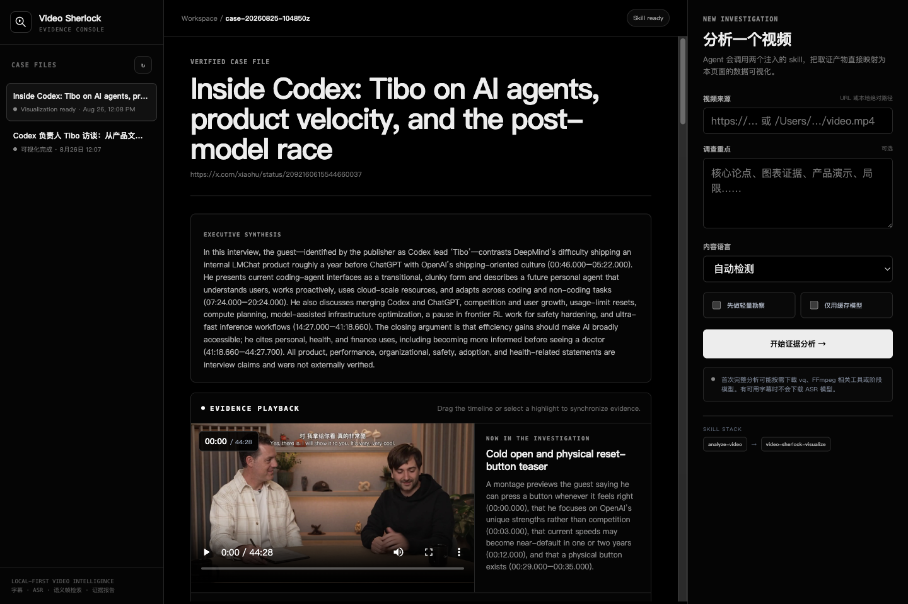

# DeepDeck Video Sherlock

[](https://dshfind.com/plugins/jo32/dsh-video-sherlock)
[](https://github.com/jo32/DeepDeck)
[](LICENSE)

A `dsh-plugin` Cordis Host/Client bundle for local-first, evidence-backed video
investigations in DeepSeek Harness.

> **Best used with [DeepDeck](https://github.com/jo32/DeepDeck).** DeepDeck
> supplies the Apps launcher, standalone app window, app-scoped Workspace and
> canonical AI conversations used to run the injected analysis skills. This
> plugin expects DeepDeck's App runtime service when it is mounted.

## Screenshot

Captured from the standalone DeepDeck desktop App window—not a browser tab.
Video playback, evidence highlights, chapters, narrative sections and inspected
keyframes stay synchronized while the original audit report remains available.



## Install with DeepDeck (recommended)

1. Open **Settings → Apps** in DeepDeck.
2. Paste `https://github.com/jo32/dsh-video-sherlock.git` into **Install an App
   plugin**.
3. Choose **Inspect source**, review the detected package and build command,
   then choose **Confirm install**.
4. Restart DeepDeck when prompted.
5. Open **Apps → Video Sherlock** from the sidebar.

For local development, build the checkout and install the resulting local
bundle into the active DeepDeck web profile:

```bash
git clone https://github.com/jo32/dsh-video-sherlock.git
cd dsh-video-sherlock
bun install --frozen-lockfile
bunx tsc --noEmit
bun run build
dsh plugin --profile web add "$PWD"
```

The last command only mounts the Cordis bundle; run it in a DeepDeck-managed
profile so the required App runtime is present.

## Usage examples

- Paste a public video URL or local media path, optionally add an investigation
  focus, then start a complete evidence analysis.
- Open a completed case and drag the video timeline or select an evidence
  highlight to seek directly to the inspected moment.
- Review transcript-density signals, time-proportional narrative chapters,
  semantic topics, inspected keyframes and explicit limitations.
- Keep separate localized presentations of the same evidence while preserving
  the authoritative transcript, timestamps and raw artifacts.

## Features

- Local-first video acquisition, transcription and semantic frame indexing
- Injected `analyze-video` and `video-sherlock-visualize` Agent Skills
- Native video playback with HTTP byte-range streaming
- Draggable timeline, chapter navigation and click-to-seek evidence highlights
- Synchronized narrative context and nearest inspected frame
- Transcript-density chart, topic index, evidence wall and limitations ledger
- Full Markdown audit report with preserved raw evidence
- Guarded same-case artifact serving with path-containment checks
- Responsive monochrome interface for standalone DeepDeck windows

Generated investigations stay in the App Workspace under `video-analyses/` and
are intentionally excluded from Git. Large source videos, transcripts, indexes
and model outputs remain local unless the user explicitly publishes them.

## Development

Requires Bun 1.4 or newer.

```bash
bun install --frozen-lockfile
bunx tsc --noEmit
bun run build
```

The Host entry, Client launcher, standalone React App and self-mounting Cordis
bundle are declared in `package.json` and `cordis.patch.yml`. Generated `lib/`
output and `node_modules/` are not committed.

## License

MIT
